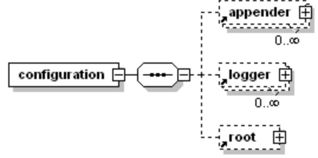
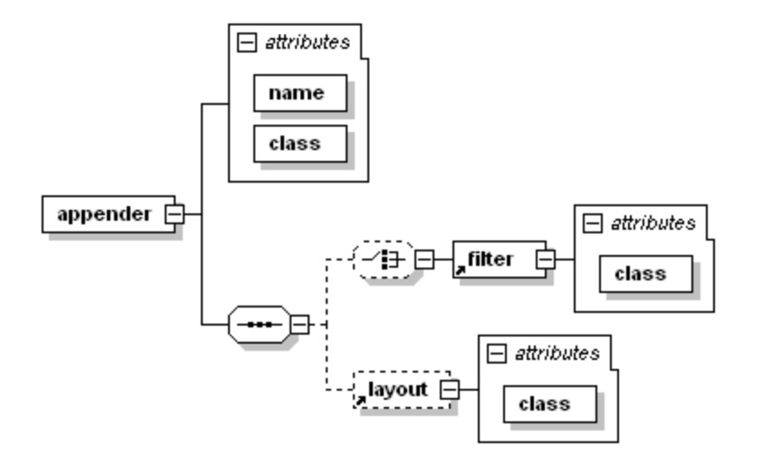

## 配置项说明 
#### 1.configuration ： 配置根节点

    <configuration scan="true" scanPeriod="60" debug="false"></configuration> 
1.1 参数说明:  
scan: 程序运行时配置文件被修改，是否重新加载。true为加载，false为不加载 默认为true  
scanPeriod: 检测配置文件被修改的时间间隔，scan属性必须设置为true才生效，默认为一分钟，默认单位为毫秒  
debug: 是否打印logback程序运行时的日志信息。true，打印 false 不打印 默认为false  

#### 2.property: 属性变量  

    <configuration scan="true" scanPeriod="60" debug="false">
        <property name="pattern" value="%d{HH:mm:ss.SSS} [%logger] %msg%n"/>
    </configuration>
2.1 参数说明:  
name: 变量的名称，可以随意起名，但建议名字要简明直译；  
value: 变量的值  
在配置文件中，我们可以用${}的方式来引用变量的值

#### 3.logger&lt;logger>: 日志对象  
logger分为两种，一种是普通日志对象，另一种是根日志对象。

    <configuration scan="true" scanPeriod="60" debug="false">
        <logger name="java.sql" level="debug" addtivity="true">
            <appender-ref ref="CONSOLE">
        </logger>
    </configuration> 
参数讲解:  
name: 用来指定此logger属于哪个包或者哪个类  
level: 用来指定此logger的日志打印级别  
addtivity: 是否向上传递日志打印信息。logger对象呈现一个树的机构，根logger是树的顶端，下面的子logger的addtivity属性如果设置为true则会向上传递打印信息，出现日志重复打印的现象；
appender-ref: 日志输出目的地，将此logger所打印的日志交给此appender。  

#### 4.logger&lt;root>: 根日志对象  

    <configuration>
        <root level="DEBUG">
            <appdender-ref ref="CONSOLE"/>
        </root>
    </configuration> 
root也是日志对象中的一种，但它位于logger体系中的最顶层。当一个类中的logger对象进行打印请求时，如果配置文件中没有为该类单独制定日志对象，那么都会交给root对象进行处理

### 5.appender：日志输出目的地

appender有两个必填的属性--name、class。name为append节点的名称，class为appender处理的全路径类名，
也就是日志输出目的地的处理类。此外，还可以设置输出的格式以及日志过滤器等
    
    <appender name="CONSOLE" class="ch.qos.logback.core.ConsoleAppender">  
        <encoder>  
            <pattern>%-4relative [%thread] %-5level %logger{35} - %msg %n</pattern>  
        </encoder>  
    </appender>
在logback中，有三种目的地处理类:
*  ch.qos.logback.core.ConsoleAppender  
eg:
<pre>
将日志输出到控制台，可以在其节点中设置<encoder>子节点，设置日志输出的格式:
&lt;appender name="CONSOLE" class="ch.qos.logback.core.ConsoleAppender">  
    &lt;encoder>  
        &lt;pattern>%-4relative [%thread] %-5level %logger{35} - %msg %n&lt;/pattern>  
    &lt;/encoder>  
&lt;/appender>
</pre>
* ch.qos.logback.core.FileAppender  
eg:
<pre>
将日志输出到具体的磁盘文件中，可以单独指定具体的位置，也可以设置日志的输出格式
&lt;appender name="FILE" class="ch.qos.logback.core.FileAppender">  
    &lt;file>e:/log.out&lt;/file>  
    &lt;append>true&lt;/append>  
    &lt;prudent>false&lt;/prudent>
    &lt;encoder>  
        &lt;pattern>%-4relative [%thread] %-5level %logger{35} - %msg%n&lt;/pattern>  
    &lt;/encoder>  
&lt;/appender>
子节点&lt;append>：新增的日志是否以追加到文件结尾的方式写入到log.out文件中，true为追加，fasle为清空现存文件写入；
子节点&lt;prudent>：日志是否被安全的写入磁盘文件，默认为false。如果为true，则效率低下；
</pre>
* ch.qos.logback.core.rolling.RollingFileAppender
eg:
<pre>
滚动记录日志，当符合<rollingPolicy>节点中设置的条件时，会将现有日志移到新的文件中去。&lt;rollingPolicy>节点中可设置的条件为：文件的大小、时间等；
&lt;appender name="FILE" class="ch.qos.logback.core.rolling.RollingFileAppender">
    &lt;file>e:/log.out&lt;/file>
    &lt;append>true&lt;/append>  
    &lt;prudent>false&lt;/prudent>
    &lt;rollingPolicy class="ch.qos.logback.core.rolling.TimeBasedRollingPolicy">
        &lt;fileNamePattern>testLog-%d{yyyy-MM-dd}.log&lt;/fileNamePattern>
        &lt;maxHistory>30&lt;/maxHistory>
    &lt;/rollingPolicy>
    &lt;encoder>
        &lt;pattern>%-4relative [%thread] %-5level %logger{35} - %msg%n&lt;/pattern>
    &lt;/encoder>
&lt;/appender>
</pre>
* ch.qos.logback.classic.AsyncAppender
<pre>
异步记录日志，内部通过使用缓存的方式来实现异步打印，将日志打印事件event放入缓存中。具体数据结构为BlockingQueue；
&lt;appender name="FILE" class="ch.qos.logback.core.FileAppender">  
    &lt;file>e:/log.out&lt;/file>  
    &lt;append>true&lt;/append>  
    &lt;prudent>false&lt;/prudent>
    &lt;encoder>  
        &lt;pattern>%-4relative [%thread] %-5level %logger{35} - %msg%n&lt;/pattern>  
    &lt;/encoder>  
&lt;/appender> 
&lt;appender name ="ASYNC" class= "ch.qos.logback.classic.AsyncAppender">  
    &lt;discardingThreshold>0&lt;/discardingThreshold>  
    &lt;queueSize>512&lt;/queueSize>  
    &lt;appender-ref ref ="FILE"/>  
&lt;/appender>  
子节点<queueSize>：指的是BlockingQueue的队列容量大小，默认为256个；
子节点<discardingThreshold>：如果BlockingQueue中还剩余20%的容量，那么程序会丢弃TRACE、DEBUG和INFO级别的日志打印事件event，只保留WARN和ERROR级别的。为了保留所有的日志打印事件，可以将该值设置为0。
</pre>

### 6.rollingPolicy  
日志的滚动策略，与RollingFileAppender搭配使用，当日志发生变动时决定RollingFileAppender的行为;  
在rollingPolicy节点中有class属性，可选值为TimeBasedRollingPolicy、FixedWindowRollingPolicy、TriggeringPolicy。  
* ch.qos.logback.core.rolling.TimeBasedRollingPolicy表示根据时间制定日志文件的滚动策略。
eg:
<pre>
&lt;rollingPolicy class="ch.qos.logback.core.rolling.TimeBasedRollingPolicy">
    &lt;fileNamePattern>testLog-%d{yyyy-MM-dd}.log&lt;/fileNamePattern>
    &lt;maxHistory>30&lt;/maxHistory>
&lt;/rollingPolicy>
</pre>
* ch.qos.logback.core.rolling.FixedWindowRollingPolicy表示如果日志文件大小超过指定范围时，会根据文件名拆分成多个文件。
<pre>
&lt;rollingPolicy class="ch.qos.logback.core.rolling.FixedWindowRollingPolicy">   
   &lt;fileNamePattern>tests.%i.log.zip</fileNamePattern>   
   &lt;minIndex>1&lt;/minIndex>   
   &lt;maxIndex>3&lt;/maxIndex>   
&lt;/rollingPolicy>
</pre>
### 7.TriggerPolicy
ch.qos.logback.core.rolling.SizeBasedTriggeringPolicy表示根据日志文件大小，超过指定大小会触发日志滚动。
<pre>
&lt;triggeringPolicy class="ch.qos.logback.core.rolling.SizeBasedTriggeringPolicy">   
   &lt;maxFileSize>5MB&lt;/maxFileSize>   
&lt;/triggeringPolicy> 
</pre>
### 8.encoder  
日志格式化节点，负责格式化日志信息。encoder只负责了两件事:1.将日志信息转换为字节数组 2.将字节数组写出到输出流  
在encoder中使用pattern来设置对应的格式。
<pre>
&lt;encoder>   
    &lt;pattern>%-4relative [%thread] %-5level %logger{35} - %msg%n&lt;/pattern>   
&lt;/encoder>
</pre>
参数解读:
* %logger{35} 表示输出logger名称，后面跟一个{0}表示:只输出logger最右边点符号之后的字符串。  
eg: com.lee.logger ->   logger;  
* %d{HH:mm:ss.SSS}表示格式化输出日期: eg:09:12:55.247;  
* %line: 输出执行日志请求的行号；
* %thread: 表示产生日志的线程名；
* %level: 表示输出日志级别；
* %method: 表示输出执行日志请求的方法名 
* %class: 表示输出执行日志请求的类名  
* %-4relative: 符号减号“-”是左对齐 标志，接着是可选的最小宽度 修饰符，用十进制数表示。relative是输出从程序启动到创建日志记录的时间，单位是毫秒;  
* %msg: 表示应用程序提供需要打印的信息；
* %n: 表示换行符  